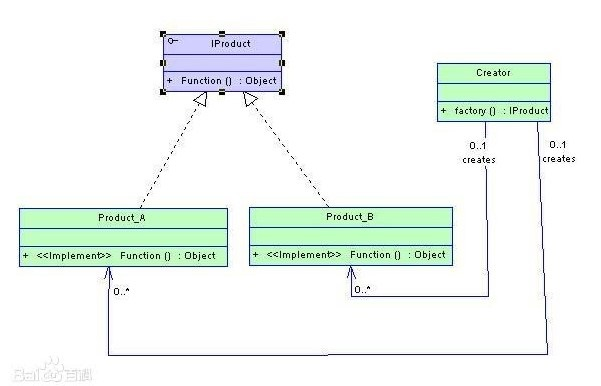

# 设计模式

## UML 类图

- TODO

## 简单工厂模式

- 
- 简单工厂模式(Simple Factory Pattern)：又称为静态工厂方法(Static Factory Method)模式，它属于类创建型模式（同属于创建型模式的还有工厂方法模式，抽象工厂模式，单例模式，建造者模式）。在简单工厂模式中，可以根据参数的不同返回不同类的实例。简单工厂模式专门定义一个类来负责创建其他类的实例，被创建的实例通常都具有共同的父类。
- 组成： 简单工厂模式由三部分组成：具体工厂、具体产品和抽象产品。
  - 工厂类（Creator）角色：担任这个角色的是简单工厂模式的核心，含有与应用紧密相关的商业逻辑。工厂类在客户端的直接调用下创建产品对象，它往往由一个具体类实现。
  - 抽象产品（AbstractProduct）角色：担任这个角色的类是由简单工厂模式所创建的对象的父类，或它们共同拥有的接口。抽象产品角色可以用一个接口或者抽象类实现。
  - 具体产品（ConcreteProduct）s角色：简单工厂模式所创建的任何对象都是这个角色的实例，具体产品角色由一个具体类实现。
- 模式动机：
  - 使用简单工厂模式可以将产品的“消费”和生产完全分开，客户端只需要知道自己需要什么产品，如何来使用产品就可以了，具体的产品生产任务由具体的工厂类来实现。工厂类根据传进来的参数生产具体的产品供消费者使用。这种模式使得更加利于扩展，当有新的产品加入时仅仅需要在工厂中加入新产品的构造就可以了。
- 优点
  - 工厂类是整个模式的关键.包含了必要的逻辑判断,根据外界给定的信息,决定究竟应该创建哪个具体类的对象.通过使用工厂类,外界可以从直接创建具体产品对象的尴尬局面摆脱出来,仅仅需要负责“消费”对象就可以了。而不必管这些对象究竟如何创建及如何组织的．明确了各自的职责和权利，有利于整个软件体系结构的优化。
- 缺点
  - 由于工厂类集中了所有实例的创建逻辑，违反了高内聚责任分配原则，将全部创建逻辑集中到了一个工厂类中；它所能创建的类只能是事先考虑到的，如果需要添加新的类，则就需要改变工厂类了。
  - 当系统中的具体产品类不断增多时候，可能会出现要求工厂类根据不同条件创建不同实例的需求．这种对条件的判断和对具体产品类型的判断交错在一起，很难避免模块功能的蔓延，对系统的维护和扩展非常不利；
  - 这些缺点在[工厂方法模式](.)中得到了一定的克服。
